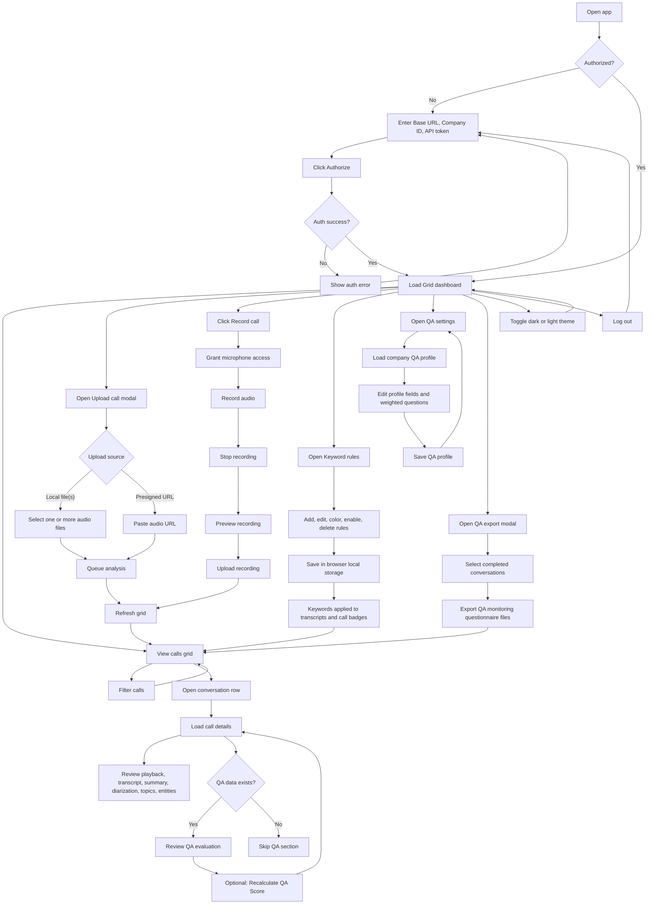

# User Dataflow

This diagram shows the main user-step flow in the call analytics frontend.

## Main User Paths

1. Authorization
   User signs in with company credentials and enters the main dashboard.

2. Grid exploration
   User filters the calls grid, opens a row, and reviews full call analytics.

3. Upload flow
   User uploads local audio files or a presigned URL, then watches the grid refresh with new calls.

4. Recording flow
   User records audio in-browser, previews it, and uploads it into the same processing pipeline.

5. QA management
   User edits the company QA profile, reviews QA results on completed calls, and can recalculate QA.

6. Keyword monitoring
   User configures keyword rules locally in the browser and sees those rules reflected in the grid and details.

7. Export flow
   User selects completed calls and exports QA monitoring questionnaire files.

8. Theme and session controls
   User can switch between dark and light theme or log out.
